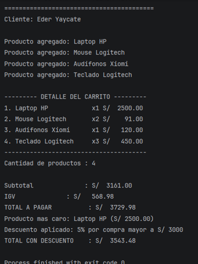

# Laboratorio 02 - Carrito de compras en Kotlin

**Nombre completo:** Eder Marcelo Yaycate Bardales

## Descripción

Programa echo  en  Kotlin que muestra  un carrito de compras. Agrega productos con nombre, precio y cantidad, calcula el subtotal, el IGV (18%) y el total, encuentra el producto más caro y aplica descuento según el monto (5% o 10%)..

### Funciones implementadas
- `calcularSubtotal`: suma el precio por cantidad de todos los productos.
- `calcularIGV`: calcula el 18% del subtotal.
- `calcularTotal`: suma el subtotal más el IGV.
- `mostrarDetalle`: imprime el detalle del carrito.
- `calcularDescuento`: aplica un descuento según el monto total.

## Resultado final

 

## Pregunta de reflexión (val vs var)

nombre y precio son val porque mantienen algo fijo o estático, mientras que cantidad es var porque puede cambiar y variar.