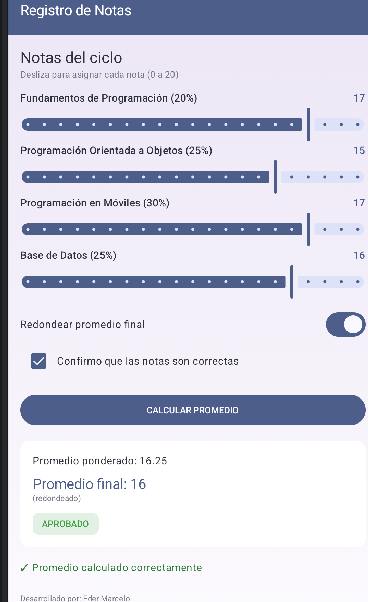
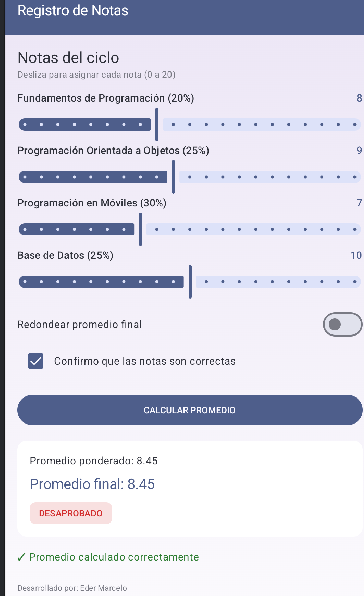

# Registro de Notas

**Curso:** Diseño y Desarrollo de Software

**Alumno:** Eder Marcelo
**Tecnología:** Jetpack Compose (Kotlin)

## Descripción
App que calcula el promedio ponderado de 4 cursos usando Slider para
asignar las notas, un Switch para redondear el promedio final, y un
Checkbox que habilita el botón de cálculo. Según el promedio final,
muestra una observación (EXCELENTE, APROBADO, EN RECUPERACIÓN o
DESAPROBADO) en un chip de color.

## Capturas

