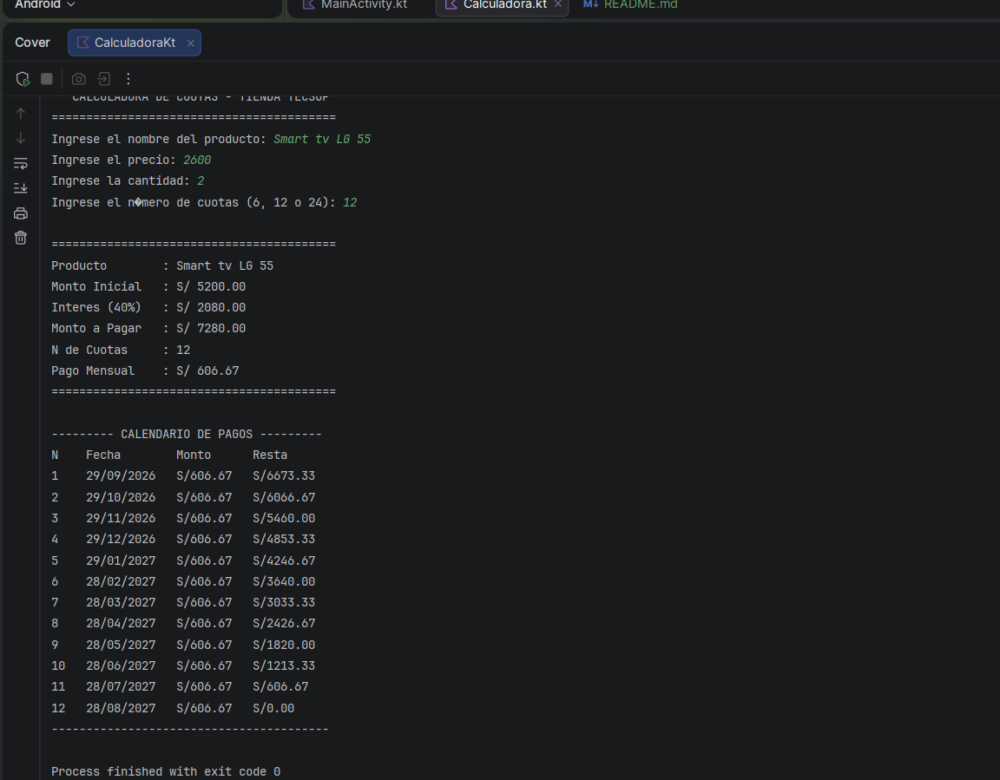

# Laboratorio 03 - Calculadora de Cuotas

Programa en Kotlin que simula una compra en cuotas, como cuando compras algo en una tienda y te dejan pagarlo en partes.

Se pide nombre del producto, precio, cantidad y numero de cuotas (solo se acepta 6, 12 o 24, cada una con un interes distinto: 20%, 40% y 60%).

Con eso calcula el monto inicial, el interes, el monto total a pagar, el pago mensual, y al final muestra un calendario mes por mes hasta que el saldo llega a S/0.00.

# Captura de pantalla
