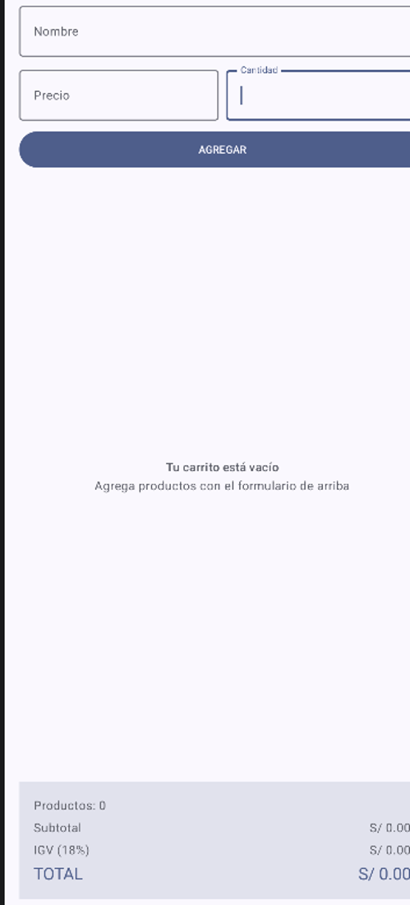
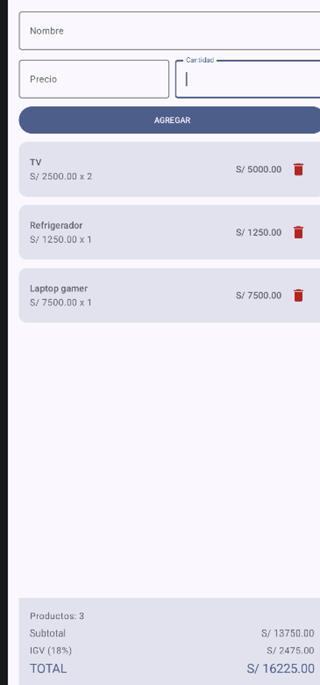

# Mi Carrito TECSUP — Laboratorio 04

**Autor:** Eder Yaycate

## Descripción

App de carrito de compras hecha en Kotlin con Jetpack Compose. Tiene un formulario
para agregar productos (nombre, precio y cantidad), una lista donde se ven todos los
productos agregados con la opción de eliminarlos, y abajo un panel fijo que muestra
el subtotal, el IGV (18%) y el total, que se recalculan al toque cada vez que agregas
o quitas algo. Si el carrito está vacío, en lugar de la lista se muestra un mensaje.

## Capturas

| Carrito vacío | Carrito con productos |
|--|-|
|  | |

## Preguntas conceptuales

**a) ¿Por qué se usa `mutableStateListOf` y no una `MutableList` normal?**

Porque una `MutableList` común no tiene forma de avisarle a Compose que cambió.
Puedes hacerle `.add()` o `.remove()` toda la vida, pero la pantalla no se entera y
se queda con lo que dibujó la primera vez. `mutableStateListOf` es básicamente una
lista que sí está "conectada" a Compose: cada vez que agregas o quitas algo, Compose
lo detecta y vuelve a dibujar la `LazyColumn` con los datos actualizados. Por eso en
este proyecto sí se ve reflejado cada producto que agrego o elimino al instante.

**b) ¿Por qué la lista es `val` y aun así se le pueden agregar elementos?**

Al principio pensé que estaba mal escrito, pero tiene sentido: `val` solo bloquea que
yo reasigne la variable a otra lista distinta (algo como `productos = otraCosa`), no
bloquea que yo modifique lo que hay adentro de esa lista. Como nunca necesito
cambiar `productos` por una lista nueva —solo agregarle o quitarle productos—, `val`
es correcto. Es lo mismo que pasa con cualquier lista mutable en Kotlin normal, no es
algo exclusivo de Compose.

**c) ¿Qué hace `weight(1f)` en la LazyColumn?**

Hace que la lista se "estire" y ocupe todo el espacio que le sobra dentro de la
`Column`, después de que el formulario y el panel de totales ya ocuparon lo que
necesitan. Gracias a eso el panel de totales siempre queda pegado abajo, sin importar
si tengo 1 producto o 20 — la lista es la que crece o se hace scrolleable, no el
panel.